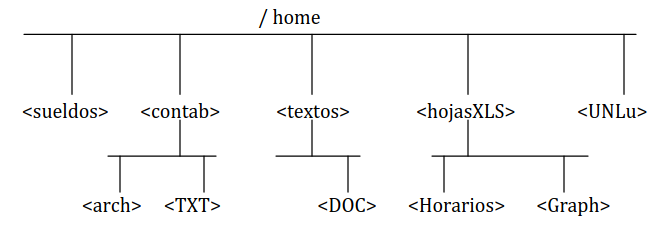

## [Volver atrás](../readme.md)

# Sistemas de Archivos

## Índice

- [Ejercicios](#ejercicios)

---

## Ejercicios

Para los ejercicios lo más probable es que necesitemos permisos de superusuario. Para loguearse como superusuario se usa el comando:

```
su -
```

Una vez ingresado nos piden la contraseña, la ingresamos y ya estamos como root:

```
[nomico@nomico ~]$ su -
Password: 
[root@nomico ~]# 
```

---

**1**. Construya la siguiente estructura de directorio en su disco, 
indicar los comandos utilizados.



Para crear directorios, utilizamos el comando mkdir (make directory), que se utiliza de la siguiente manera:

```
mkdir NOMBRE_DIRECTORIO
```

Pueden crearse varios directorios con una sola invocación de mkdir, por ejemplo:

```
mkdir rojo verde
```

Crea una carpeta "rojo" y una carpeta "verde".

Con el argumento -p podemos crear directorios y sus subdirectorios, por ejemplo:

```
mkdir -p hola/mundo
```

Crea el directorio "hola" y su subdirectorio "mundo".

Usamos el comando cd (change directory) para movernos entre los directorios. Se utiliza de la siguiente manera:

```
cd DIRECTORIO
```

El comando cd puede usarse también con "." o con "..". El "." hace referencia al directorio en el que nos ubicamos actualmente,
mientras que ".." hace referencia al directorio padre del directorio actual.

```
[root@nomico ~]# cd /home
[root@nomico home]# mkdir sueldos
[root@nomico home]# mkdir -p contab/arch
[root@nomico home]# mkdir -p contab/TXT
[root@nomico home]# mkdir -p textos/DOC
[root@nomico home]# mkdir -p hojasXLS/Horarios hojasXLS/Graph
[root@nomico home]# mkdir -p UNLu
```

---

**2**. En el subdirectorio UNLu se tiene un conjunto de archivos, se pide copiar aquellos cuya extensión sea:

"txt" en el subdirectorio ../textos/DOC,

".cpp" en ../contab/arch,

"txt" en /contab/TXT, 

"xls" en ../hojasXLS/Horarios, 

"grp" en ../hojasXLS/Graph. 

Indicar los comandos utilizados.

Primero creo unos archivos para hacer el ejercicio:

```
touch NOMBRE_ARCHIVO
```

El nombre del archivo también puede ser una ruta, por ejemplo:

```
touch ./cosas/texto.dat
```

Crea un archivo "texto.dat" dentro de la carpeta cosas del directorio actual.

```
[root@nomico home]# touch ./UNLu/archivo1.txt
[root@nomico home]# touch ./UNLu/archivo2.txt
[root@nomico home]# touch ./UNLu/archivo3.cpp
[root@nomico home]# touch ./UNLu/archivo4.txt
[root@nomico home]# touch ./UNLu/archivo5.xls
[root@nomico home]# touch ./UNLu/archivo6.grp
```

Para copiar los archivos utilizamos el comando cp. Se usa de la siguiente manera:

```
cp ARCHIVO DIRECTORIO_DESTINO
```

Ahora cuando queremos tomar un conjunto de archivos con un mismo formato, usamos un * seguido del formato del archivo.


- **".txt" en el subdirectorio /textos/DOC**
```
[root@nomico home]$ cp ./UNLu/*.txt ./textos/DOC
```

- **".cpp" en /contab/arch**
```
[root@nomico home]$ cp ./UNLu/*.cpp ./textos/DOC
```

- **".txt" en /contab/TXT**
```
[root@nomico home]$ cp ./UNLu/*.txt ./contab/TXT
```

- **".xls" en /hojasXLS/Horarios**
```
[root@nomico home]$ cp ./UNLu/*.xls ./hojasXLS/Horarios
```

- **".grp" en /hojasXLS/Graph**
```
[root@nomico home]$ cp ./UNLu/*.grp ./hojasXLS/Graph
```

Otra manera de hacer esto sería ubicándonos en el directorio "UNLu"...

```
[root@nomico ~]$ cd home 
[root@nomico home]$ cd UNLu
```

... y a partir de acá hacer lo mismo que antes, pero en vez de indicar el directorio "UNLu" en cada referencia a un directorio, indicamos el directorio "home" de la siguiente manera, por ejemplo:

- **"txt" en el subdirectorio ../textos/DOC**
```
[root@nomico UNLu]$ cp *.txt ../textos/DOC
```

Cuando usamos ".." estamos haciendo referencia al directorio padre del directorio en el que nos situamos actualmente, en este caso estamos en el directorio "UNLu" y con ".." hacemos referencia a su directorio padre, el cual es "home".

---

**3**. Mover la estructura y el contenido del subdirectorios /contab 
a partir del subdirectorio /sueldos. Indicar los comandos utilizados.

```
[root@nomico ~]$ cd home
```

Para mover archivos o directorios, utilizamos el comando mv (move). Se usa de la siguiente manera:

```
mv ARCHIVO DIRECTORIO_DESTINO
```

```
[root@nomico home]$ mv ./contab/* ./sueldos
```

En este caso, cuando usamos el "*" con un directorio, estamos haciendo referencia a todo el contenido del directorio, 
sin tener en cuenta el directorio mismo. Si nos pidieran mover también el directorio contab, el comando sería el siguiente:

```
[root@nomico home]$ mv ./contab ./sueldos
```

---

**4**. Indicar que comandos utilizaría para conocer el contenido de un subdirectorio, y qué modificadores usaría 
(describir por los menos 6 de ellos), indique cuál es el que brinda mayor cantidad de información. 
En este caso se puede pedir ayuda al sistema mediante el uso del comando "--help" o el empleo del mandato "man comando". 
¿Da lo mismo usar “ls home –l” que ” ls –l home”?

Para ver el contenido de un directorio podemos usar el comando ls (list).

Algunos de sus argumentos son los siguientes:

```
ls -a
```
Muestra todos los archivos, incluso los ocultos (empiezan con ".") y también el directorio actual (.) y el directorio padre (..).

```
ls -i
```
Muestra el contenido del directorio y el inodo índice de cada archivo

```
ls -l
```
Muestra el contenido del directorio en un formato más largo. Este es el que brinda mayor cantidad de información, y se puede combinar con otros argumentos para mostrar aún más información.

```
ls -r
```
Muestra el contenido del directorio de forma inversa

```
ls -S
```
Muestra el contenido del directorio de forma ordenada, de mayor a menor tamaño.

```
ls -t
```
Muestra el contenido del directorio de forma ordenada, de más nuevo a más antiguo.

Un detalle a tener en cuenta es que **el orden de los argumentos no afecta la salida**, entonces si hago:

```
ls -l /home
```
ó
```
ls /home -l
```
La salida resulta ser la misma.

---

**5**. Indique qué comando utilizaría para ver el contenido de un archivo.

```
cat archivo
```
Muestra todo el contenido de un archivo.

```
more archivo
```
Muestra el contenido de un archivo de forma paginada.

```
less archivo
```
Similar a more, pero permite desplazarse en el archivo libremente y otras funciones como búsqueda de palabras y modificar el archivo.

```
head archivo [-n cantidad]
```
Muestra las primeras n líneas del archivo, por defecto son 10 y se pueden especificar con -n.

```
tail archivo [-n cantidad]
```
Igual que head pero para ver las últimas n líneas del archivo. En general se utiliza para ver logs.

---

**6**. Indicar que tipos de protección se pueden incorporar a los archivos.

A cada archivo se le puede asignar permisos, los cuales pueden variar entre los tres tipos de usuarios (owner, group y other).

Con chmod se pueden cambiar los permisos de un archivo:

```
chmod [opción] archivo
```

Dentro de las opciones que se pueden especificar, hay que tener en cuenta lo siguientes caracteres:

**Tipos de usuarios**

- **a**: todos los usuarios
- **u**: owner del archivo
- **g**: group del archivo
- **o**: other (otros usuarios)

**Operadores**

- **+**: agregar permiso
- **-**: remover permiso
- **=**: asignar permiso

**Permisos**

- **r**: lectura. También se representa con el valor **4**.
- **w**: escritura. También se representa con el valor **2**.
- **x**: ejecución. También se representa con el valor **1**.

Ejemplos:

```
chmod a=r archivo.txt
```
Da permisos de lectura a todos los usuarios para archivo.txt. También se puede hacer de esta manera:

```
chmod 444 archivo.txt
```
Cada unidad del número representa a un tipo de usuario. El primer 4 significa que se le asigna el permiso de lectura al owner, el segundo 4 le asigna permiso de lectura al group, y el tercer 4 le asigna permiso de lectura al resto de usuarios (other).

```
chmod u=w archivo.txt
```
Da permisos de escritura sólo al propietario. También se puede hacer de esta manera:

```
chmod 200 archivo.txt
```

Se pueden asignar varios permisos para los diferentes tipos de usuarios al mismo tiempo. Por ejemplo:

```
chmod 671 juego
```
En este comando:
- 6: se le da permiso de lectura y escritura al owner. 6 porque 4 (lectura) + 2 (escritura).
- 7: se le dan todos los permisos al group. 7 porque 4 (lectura) + 2 (escritura) + 1 (ejecución).
- 1: se le da permiso de ejecución a other.

El comando chown se puede utilizar para cambiar el propietario del archivo:

```
chown usuario archivo
```

Por ejemplo:

```
chown nomico /home/UNLu/archivo1.txt
```

Cambio el owner a nomico para archivo1.txt.

El comando chgrp se puede utilizar para cambiar el grupo del archivo, de manera similar a chown:

```
chgrp devs /home/contab/arch/*.cpp
```
Cambio el grupo a devs para todos los archivos que terminan con .cpp.

---

**7**. Para los archivos ubicados en el subdirectorio /hojasXLS/Horarios 
cambie los permisos que presentan al modo de sólo lectura para los usuarios del sistema,
lectura / escritura para los miembros del grupo y lectura/escritura y ejecución para el dueño. 
Indicar el comando utilizado.


---

## [Volver atrás](../readme.md)